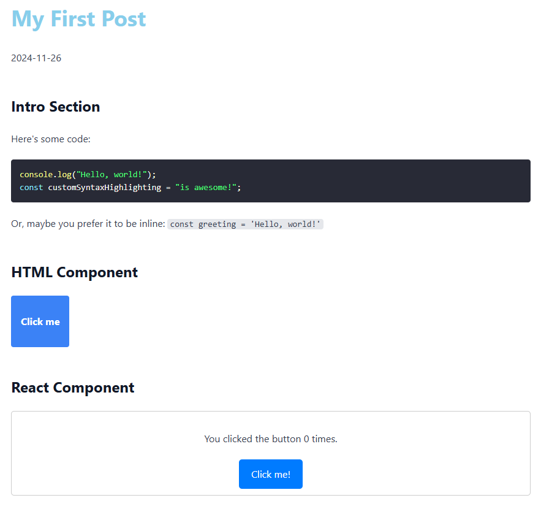

# MDX with React + Vite

In order to follow along with this tutorial, you need to install some dependencies. Make sure you have a package manager like npm or yarn, and run `npm install`or `yarn install` to resolve all the packages before starting.

You can find the example blog site here: https://mdx-react-vite.vercel.app/

Here are the demo directory page and blog page.

